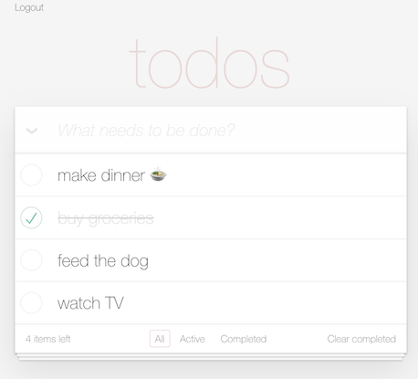

# todo-vue3



This is a variation of the familiar TodoMVC demonstration SPA which integrates with Firebase authentication and
Firebase Real-time Database for persistence of the todo items.


## Firebase setup

You will need to setup a Firebase project with Authentication (email/password) and with Runtime Database setup.  The RTDB
setup needs an endpoint of `todos/` to store the todos.

Make sure you setup appropriate access rules for the RTDB to ensure that the authentication protects the data.

## Project Setup

```sh
npm install
npm run dev     # development server
npm run build   # build the app
npm run test:unit
```
